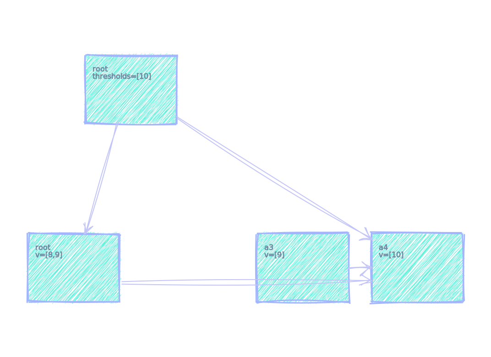
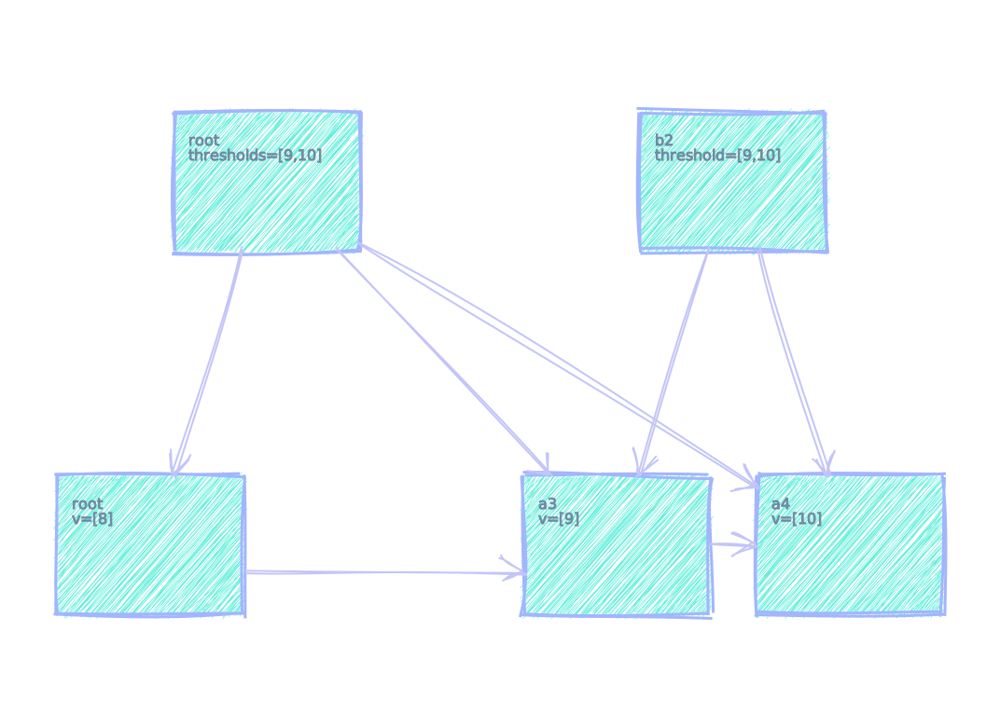

ずっとほしかったお絵かきツールを自作した

# 概要
システムやアルゴリズムの動作図（パラパラ漫画）を、テキスト記述から生成できるツールを作りました。

# 特徴

- テキストベースの記述
	- DOT（Graphviz）風の言語で記述します。1枚絵ではなく、動作をテキストで記述して動作図（パラパラ漫画）を生成します。
- SVGへ出力

# 背景
既存のお絵かきツール・図表生成ツールには下記の使いにくさがありました。

- GUIのお絵かきツール
	- 自由に配置できる反面、要素数が多いと作図・調整が手間
	- 複数の図があるとき、1枚変更すると後続の図も修正しないといけない

- テキストベースの図表生成ツール
	- 要素の位置の指定がしにくい
	- 状態変化を表現しにくい
		- 要素の追加・削除で他要素の位置が変わってしまう
		- 変更点だけを記述できないので記述量が多くなりがち（図の枚数分、図全体を記述しないといけない）

そこで自動で図中の各要素の配置を調整して動作図を作成できるツールを開発しました。

# ギャラリー
下記のような図が作成できます。一部 [rougher.js](https://github.com/signdoubt/rougher) により手書き風にしています。



---



---


---


# 文法＆機能

文法は `Sysvis.g4` ファイルに記載の通りです。

## 基本図形

基本図形として`box` / `person` / `cylinder`が指定できます。要素間に矢印を配置できます。

```
{basic-shapes.sysvis}
```


## 動作図（パラパラ漫画）を出力

`---` で動作図の各フレームを区切ります。最初の `---` が出るまでが初期状態です。

```
{simple-animation.sysvis}
```


---


---


## ラベル / テキスト

```
{label-text.sysvis}
```


## SVG属性

SVGの属性が指定できます。

```
{svg-attributes.sysvis}
```


## Zone / Group

図表の構成要素をまとめる方法として下記のものがあります。

- `Group`
	- 横方向にならべてまとめます
- `Zone` 
	- 縦方向にならべてまとめます

```
{group-zone.sysvis}
```


## Margin / Padding

ウェブページにおける `margin`/`padding` のような余白を設定できます。

```
{margin-padding.sysvis}
```


## dx / dy

自動配置の結果、矢印が重なってしまうケースがあります。`dx`/`dy`属性を指定することで矢印の配置をずらすことができます。

```
{dx-dy.sysvis}
```


## 均等配置（左詰めしない）

```
{align-center.sysvis}
```


## 差分記述モード

下記のようにファイルの先頭に記述することで、差分での記述できます。アルゴリズムの動作説明などの「小さな変化がつみかさなる」ようなものの場合に差分記述モードが役立ちます。

```
config='mode=diff';
```

`align` の設定と組み合わせる場合は下記のように `,` で区切ります。

```
config='mode=diff,align=center';
```


```
{diff-mode.sysvis}
```


---


---


初期状態で非表示にすれば、変更があってから表示されるようにできます。

```
{array-list.sysvis}
```


---

